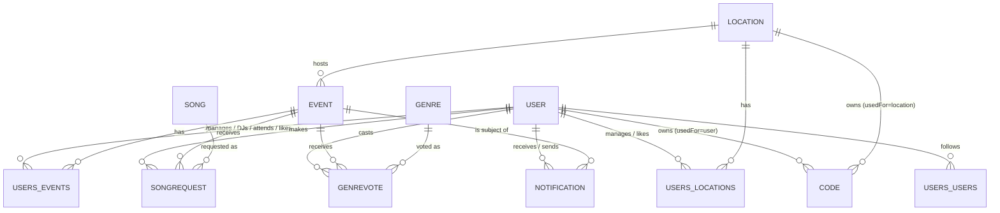

# PartyPulse — Project Overview

This document explains what PartyPulse is, who uses it and how, and how its domain
could be carried into a different language or a different architecture (e.g.
microservices instead of a single Next.js app). It's written from reading the
codebase, not from external docs — the app has none.

---

## 1. What the product is

PartyPulse is a small social/event platform for **live nightlife events** (club
nights, parties). It connects three kinds of people around a physical event:

- **Attendees** — regular people who go to parties, follow friends and venues,
  and, once physically present at an event, can vote on the genre being played
  and suggest songs to the DJ.
- **DJs** — play the event, see live song requests and genre-vote results, and
  control whether those live features are turned on.
- **Event Managers (EMs)** — own/manage venues ("locations"), create events at
  them, assign DJs, and run the event lifecycle (not started → live → over).

The defining mechanic is **presence-gated live interaction**: song suggestions
and genre voting only work once you've proven you're physically at the event, by
scanning a QR code tied either to the DJ or to the venue. That check-in is what
unlocks the "Live" screen.

## 2. Actors / roles

There is one `users` table with a `role` column reused as a coarse role flag:

| role value | meaning     | how you get it                                   |
|-----------:|-------------|---------------------------------------------------|
| 0          | regular user (attendee) | default on signup |
| 1          | Event Manager (EM)      | self-service "Become an EM" (`POST /api/user/partner {ptype:1}`) |
| 2          | DJ                       | self-service "Become a DJ" (`POST /api/user/partner {ptype:2}`), picks a `dj_<username>` handle |

There's no admin role and no approval workflow — anyone can flip themselves into
an EM or DJ at will. Role is authorization-relevant only for creating locations
(`role != 0` required); most real permissions are actually per-resource
relationships (see below), not the global role.

## 3. Core domain concepts

| Entity | Represents | Key fields (as used) |
|---|---|---|
| **User** | An account | `fname/lname/uname/email`, `hash` (bcrypt), `role`, `verified` (0, or a pending 6-digit code, or `1`), `donations` (a donation-page URL DJs can advertise), `emailNotif` |
| **Location** | A physical venue | `name`, `adress`/`useForAdress` (address vs. coordinates vs. name-based lookup), `city`, `lat/lon`, `private` (an ad-hoc location created inline for one event vs. a real reusable venue) |
| **Event** | A single party/night at a location | `name`, `privateev` (invite-only), `dateStart`, `duration`, `status` (0 = not started, 1 = **live**, 2 = over), `msuggestions`/`genreVote` (per-event toggles for the two live features), `locationId` |
| **Code** | A redeemable token | `usedFor` (`user`, `location`, or `recovery`), `itemId`, `code`. `user`/`location` codes are the QR-code check-in mechanism; `recovery` codes are for password reset |
| **Song** | A cached track | Mirrors a subset of a Spotify search result (`spotifyId`, `title`, `artists`, `imgsrc`, `preview`, optional `youtubeId`) |
| **SongRequest** | An attendee's live suggestion | `eventId`, `userId`, `songId`, `status` (0 live / 1 queued / 2 canceled / 3 played — DJ-controlled) |
| **Genre** / **GenreVote** | A global genre list + one live vote per (user, event) | vote is replace-not-append: `changeVote` overwrites the user's existing pick |
| **Notification** | An in-app + optional-email notification | `forUserId`, `fromUserId`, `nottype` (e.g. `invitation-to-event`, `event-manager-add`, `event-reaction`, `like`), `itemType`/`itemId` linking back to an event or location |
| **users_events** (relationship table) | A user's relationship to an event | `reltype`: 1 = manages it, 2 = is a DJ on it, 3 = **checked in / "there"** (set by scanning a code, cleared when checking into a different live event), 4 = "coming", 5 = "liked" |
| **users_locations** | A user's relationship to a location | `reltype`: 1 = manages it, 0 = "liked" |
| **users_users** | Follow/friend graph | `reltype`: 1 = "follows" (asymmetric; `followsYou`/`youFollow` derived by comparing both directions) |

Everything permission-relevant in the app is really "does this `users_events` /
`users_locations` row exist with this `reltype`", not a role check — that's the
single most important invariant to preserve in a rewrite.

## 4. Use cases by actor

### Account / cross-cutting
- Register with email+password, or sign in with Google/Spotify OAuth (auto-creates an account on first OAuth login).
- Verify email via a 6-digit code sent by mail.
- Forgot-password flow via an emailed one-time recovery code.
- Manage profile, change password, toggle email notifications.
- Follow/unfollow other users; see who follows you; search users/locations/events.
- Receive notifications (invites, someone liking/coming to your event, being promoted to event-manager on an event, follows).

### Attendee
- Browse a home feed: events from people you follow + events at locations you've liked.
- Look up a location or event page; "like" or mark "coming" to a (public or invited) event.
- **Check in to a live event** by scanning a DJ's or a venue's QR code (redeems a `code`, resolves to whichever event that DJ/venue currently has `status = 1`, sets your `users_events` relation to `reltype = 3`).
- Once checked in: vote for a music genre (if the DJ enabled it) and suggest a song from Spotify search (if the DJ enabled it); see live genre-vote standings.
- Confirm attendance messaging is shown until check-in happens.

### DJ
- Get invited to / assigned onto an event by its EM.
- Generate and manage personal QR invite codes.
- Toggle "music suggestions" and "genre vote" on/off for an event they're on.
- See the live song-request queue, filter it (live/queued/canceled/played), sort it, and change each request's status.
- See live genre-vote leaderboard (top 3).
- Advertise a donations-page link, editable live from the DJ view.

### Event Manager
- Create/manage locations (venues): address or GPS-coordinate based, or an ad-hoc private location scoped to one event.
- Generate and manage venue QR invite codes; grant/revoke other users' management access to a venue.
- Create events: name, date/time/duration, public or invite-only, assign DJs by username, pick an existing venue or create one inline.
- Start / stop / end an event (drives `status` 0→1→2); the system prevents starting a new event while you already have another one live, unless you explicitly force-close it.
- Invite specific users to a private event.
- View event reactions (who's liked/coming).

## 5. Representative end-to-end flows

**Setting up a night:** EM registers → becomes an EM → creates a Location →
creates an Event at that location, assigning one or more DJs → EM or an
assigned DJ flips the event to `status = 1` (live) when the night starts.

**Getting a crowd live:** The DJ or EM shares a QR code (their own "user" code,
or the venue's "location" code). An attendee scans it → hits
`/code/[code]` → `POST /api/code/verify` → server finds whichever live event
that DJ/venue currently has → creates/updates the attendee's `users_events`
row to `reltype = 3` → attendee is redirected into `/dash/live`, which now
renders the live event view instead of "confirm attendance".

**Live interaction loop:** Attendee's live view polls `GET /api/user/event`
to know if they're checked into something live. The DJ dashboard polls
`GET /api/event/live?evId=` every 5s to refresh the request queue and vote
tally. There is no websocket/push layer anywhere — every "live" surface in the
app is short-interval client polling.

**Social loop:** Following someone, liking an event, or being invited each
create a row in `users_users`/`users_events` plus a `UserNotification`, which
optionally triggers an email via nodemailer if the recipient has
`emailNotif = 1`.

## 6. Current technical architecture (as-is)

- **Framework:** Next.js 14, App Router. Every backend endpoint is a
  `route.ts` file under `src/app/api/**` — effectively one Next.js
  deployment acting as both the frontend and a set of serverless-style
  functions (there is no separate backend process).
- **Data layer:** raw SQL against MySQL via `mysql2`, no ORM/query builder.
  A thin `db` wrapper (`src/app/api/_lib/config/db.ts`) exposes `execute`
  (unparameterized) and `safeexe` (parameterized). "Models" under
  `_lib/models/*.ts` are plain classes with static methods building SQL by
  hand — there is no migration tool; schema exists only implicitly, as the
  union of every query in the codebase.
- **Auth:** two systems running side by side.
  - `next-auth` handles the Google/Spotify OAuth **handshake only**.
  - A hand-rolled JWT (`jsonwebtoken`, signed with `TOKEN_KEY`) stored in a
    cookie is the *actual* session mechanism used by literally every API
    route (`getUserFromToken(cookie)`), including the credentials
    (email+password) login path. There's no `middleware.ts`; each route
    re-implements its own "read token → verify → check `.id`" check.
  - A handful of non-sensitive fields (`uname`, `role`, `donations`, …) are
    mirrored into their own cookies purely so client components can read
    them synchronously without a round-trip.
- **Frontend state:** React Context (`UserContext`, `AlertContext`,
  `LoadManContext`, …), hydrated from cookies on mount — no client-side data
  library (no React Query/SWR); each component manages its own `axios`
  calls and local state.
- **"Real-time":** plain polling. The DJ's live queue and the attendee's
  "am I in a live event" check both re-fetch on a `setTimeout` loop
  (~5s). No WebSockets, SSE, or pub/sub.
- **External integrations:** Spotify Web API (client-credentials flow) for
  song search, Google Maps (via an API key) for address lookup/display,
  SMTP via `nodemailer` for verification/recovery/notification emails.
- **Deployment shape:** a single deployable unit. Scaling, auth, business
  logic, and the DB access layer are not separated — everything lives in
  one Next.js process talking to one MySQL instance.

## 7. Domain model (entity relationships)



Note the two "relationship as fact table" entities (`users_events`,
`users_locations`) each carry *one* `reltype`, so a user can currently only
hold one relation to a given event (e.g. can't be both "DJ" and "coming"
simultaneously as separate rows) — that's an implicit constraint worth making
explicit if this is remodeled.

## 8. Rewriting this: language- and architecture-agnostic view

The point of this section is to describe the app in terms that survive a
rewrite — i.e., what has to remain true regardless of the implementation
language or whether it's one service or ten.

### 8.1 Bounded contexts

The domain splits cleanly into these contexts, each of which could become a
module (in a modular monolith) or a service (in microservices):

1. **Identity & Access** — accounts, credentials, OAuth linking, sessions,
   password reset, email verification. Owns `User` (identity fields only).
2. **Social Graph** — follow relationships, user search/discovery,
   notifications delivery (in-app + email).
3. **Venue (Location) Management** — locations, venue management rights,
   venue invite codes.
4. **Event Management** — events, event lifecycle (`draft/live/over`), DJ
   assignment, event management rights, event invite codes, reactions
   (like/coming).
5. **Live Session** — everything that only makes sense while an event's
   status is "live": check-in/presence, genre voting, song-request queue and
   its DJ-side triage. This is the part most different in shape from the
   rest (needs low-latency read/write and push, not just CRUD).
6. **Music Catalog** — Spotify search proxy + the local song cache used to
   back song requests. Naturally an adapter/anti-corruption layer around a
   third-party API.
7. **Notifications & Messaging** — fan-out of domain events into in-app
   notifications and outbound email.

Contexts 3 and 4 are tightly coupled today (an event always needs a
location) but are separable if Location becomes a proper shared "venue
directory" service that other consumers (e.g. future non-party locations)
could use.

### 8.2 Domain events worth modeling explicitly

A rewrite — especially a microservices one — should stop passing "did this
SQL UPDATE succeed" around and instead emit real domain events, e.g.:

- `UserRegistered`, `UserVerified`, `UserRoleChanged`
- `LocationCreated`, `LocationAccessGranted`
- `EventCreated`, `EventWentLive`, `EventEnded`
- `AttendeeCheckedIn` (the QR redemption)
- `SongSuggested`, `SongRequestStatusChanged`
- `GenreVoteCast`
- `UserFollowed`, `EventReactionAdded`, `InviteSent`

These map almost 1:1 onto the current `UserNotification` "types"
(`invitation-to-event`, `event-manager-add`, `event-reaction`, `like`) —
which is a good sign the domain boundary is already implicitly there, just
not formalized as events.

### 8.3 Suggested architecture if staying a single service (modular monolith)

If the goal is "rewrite in another language" without necessarily going to
microservices, structure it as layers instead of the current
"route handler calls a static model method that builds raw SQL" pattern:

```
HTTP layer (controllers)        — thin, only (de)serialization + auth context
   |
Application/use-case layer      — one function per use case (e.g. "CheckInAttendee",
   |                               "StartEvent", "SubmitSongRequest"); this is where
   |                               the *authorization* checks the current code
   |                               scatters per-route should live, uniformly
Domain layer                    — entities + invariants (e.g. "an event can only
   |                               go live if the organizer has no other live event",
   |                               "a genre vote replaces, not appends")
Repository/persistence layer    — one interface per aggregate, SQL (or ORM) behind it,
                                   parameterized always, no string-built SQL
```

This alone — independent of language — fixes the two structural sources of
the SQL-injection and missing-authorization issues found in review: business
rules and auth checks were duplicated ad hoc inside ~40 route handlers
instead of centralized in one place.

### 8.4 Suggested microservices decomposition

If actually splitting into services, a reasonable first cut:

| Service | Owns | Talks to |
|---|---|---|
| **identity-service** | users, credentials, sessions, OAuth linking | issues signed tokens (e.g. real JWT/OIDC) other services verify locally |
| **social-service** | follow graph, user search/directory | reads identity for display names |
| **venue-service** | locations, venue access rights, venue codes | — |
| **event-service** | events, event lifecycle, DJ assignment, event access rights, event codes, reactions | venue-service (location ref), identity (owner/DJ refs) |
| **live-session-service** | check-in/presence, genre votes, song-request queue | event-service (is this event live?), music-catalog (resolve a song), identity (who's asking) |
| **music-catalog-service** | Spotify search proxy, song cache | external Spotify API |
| **notification-service** | in-app notifications, email dispatch | subscribes to domain events from every other service |

Communication pattern: synchronous request/response (REST or gRPC) for
CRUD-shaped reads/writes between services; an event bus (Kafka/NATS/SQS —
whatever fits the target stack) for the notification fan-out, so
notification-service doesn't need to be called by name from seven other
services the way `UserNotification.save()` is today.

The **Live Session** service is the one piece that most benefits from a
genuine architecture change, not just a language port: replace the current
5-second polling with a push channel (WebSocket or SSE) so the DJ's queue
and the attendee's genre-vote view update immediately. This is also the
natural place to introduce a fast in-memory/cache store (e.g. Redis) for
"who's currently checked into which live event" and "current vote tally",
since that state is inherently ephemeral and rebuilt each time an event goes
live — it doesn't need the same durability/consistency treatment as the
historical event/venue data in the relational store.

### 8.5 Data storage guidance for a rewrite

- Keep one relational store (Postgres is a reasonable MySQL replacement) for
  the durable entities: users, locations, events, follow graph, historical
  song requests/votes.
- Consider a separate fast store (Redis or similar) for **live-session**
  ephemeral state (active check-ins, live vote tallies, live request queue)
  if you build the push-based version — this is the state that's currently
  being re-derived by SQL `JOIN`+`JSON_ARRAYAGG` queries on every 5s poll,
  which won't scale once it's push-driven and high-frequency.
- The `Song` cache table can stay relational (it's just a dedup cache keyed
  on `spotifyId`), or move behind a proper cache with TTL if song metadata
  freshness matters.

### 8.6 Migration path (if evolving in place rather than a big-bang rewrite)

1. Introduce the layered structure (8.3) inside the current Next.js app
   first — pull the scattered auth checks and raw SQL into one
   application/domain/repository layering, still MySQL, still monolithic.
   This alone removes most of the risk found in the earlier security review
   and makes the domain boundaries in §8.1 visible in the code.
2. Extract **music-catalog** first (it's a pure stateless proxy with no
   dependency on the rest of the domain) to validate the service-extraction
   process cheaply.
3. Extract **notification-service** next, switching from direct in-process
   calls to publishing the domain events from §8.2 — this decouples every
   other future extraction from having to know how notifications work.
4. Extract **live-session** last, and only once you're actually
   replacing polling with push — that's where the real payoff of splitting
   this out lives, not just organizational separation.

---

*This document reflects the app as implemented, including some rough edges
(inconsistent naming like `adress`/`useForAdress`, the `role` field doing
double duty, single-`reltype`-per-relationship) that a rewrite would be a
natural opportunity to clean up rather than carry forward.*
